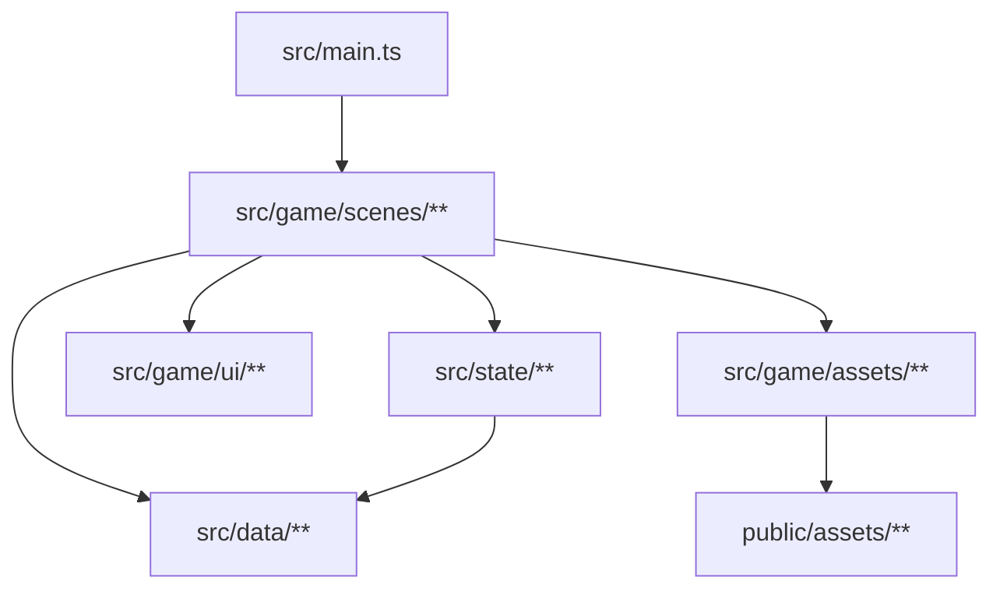
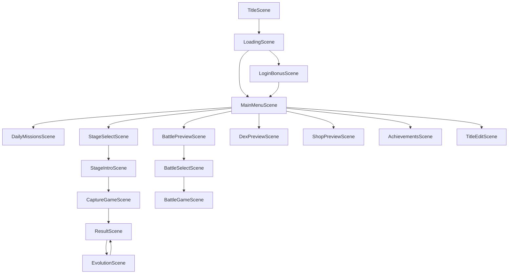
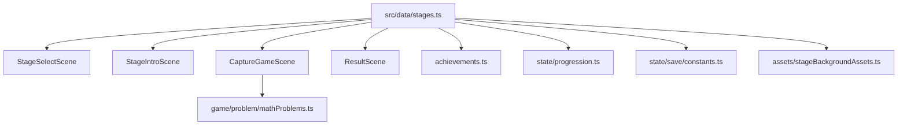
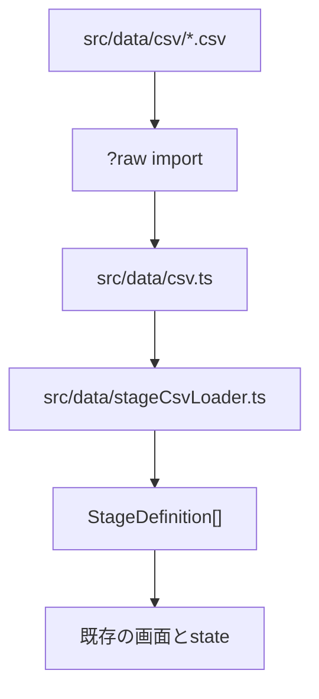

# 今のコードの見取り図

この文書は開発者向けです。アプリ内に表示される文言ではありません。

目的は、今のコードがどこで何を持っていて、`stages` のような深いデータをCSV化するときに何をほどけばよいかを見えるようにすることです。

## まず読む場所

| 見たいもの | 主なファイル |
| --- | --- |
| 起動と画面登録 | `src/main.ts`, `src/game/sceneKeys.ts` |
| データの型 | `src/game/types.ts` |
| ステージ定義 | `src/data/stages.ts` |
| モンスター定義 | `src/data/csv/monsters.csv`, `src/data/monsterCsvLoader.ts`, `src/data/monsters.ts` |
| トレーナー定義 | `src/data/csv/trainers.csv`, `src/data/trainers.ts` |
| 出題生成 | `src/game/problem/mathProblems.ts` |
| ステージ解放 | `src/state/progression.ts` |
| セーブと正規化 | `src/state/save.ts`, `src/state/save/*` |
| 画面 | `src/game/scenes/**` |
| 共通UI | `src/game/ui/**` |
| 画像アセット対応表 | `src/game/assets/**`, `public/assets/**` |

## 大きな構成

このアプリは Phaser + Vite + TypeScript の構成です。画面サイズは `src/game/constants.ts` の `GAME_WIDTH = 390`, `GAME_HEIGHT = 844` を基準にしています。

`src/main.ts` で Phaser のゲームを作り、使う Scene をまとめて登録しています。画面遷移のキーは `src/game/sceneKeys.ts` に集約されています。



## 画面の流れ

主な画面の流れは次の通りです。



## データ層

`src/data` は、ゲームのマスターデータを持つ場所です。

| ファイル | 役割 |
| --- | --- |
| `csv/stage_*.csv`, `csv/stages.csv` | ステージ、ジャンル、出題ルール、出現モンスター、解放条件 |
| `stages.ts` | ステージCSVを読み、既存コード向けに検索関数を出す入口 |
| `stageCsvLoader.ts` | 複数CSVから `StageDefinition[]` を組み立てる変換層 |
| `csv/monsters.csv` | モンスター本体。名前、ID、属性、説明、画像ファイル名など |
| `monsterCsvLoader.ts` | `monsters.csv` を読み、進化系列、能力値、必要かけら数を組み立てる変換層 |
| `monsters.ts` | モンスター検索、出現率、連続出現補正などの関数 |
| `csv/trainers.csv` | トレーナーのマスターデータ |
| `trainers.ts` | CSVからトレーナー定義を作る変換層 |
| `shopItems.ts` | ショップアイテム |
| `dailyMissions.ts` | デイリーミッション |
| `achievements.ts` | 実績。ステージとモンスターから一部を自動生成 |
| `achievementRanks.ts` | 実績ランク |
| `titleBackgrounds.ts` | タイトル背景 |
| `csv.ts` | CSV読み込み用の共通関数 |

現在、ステージとトレーナーはCSV化済みです。アプリ側から見ると `stages.ts` と `trainers.ts` が今まで通り型付きの配列を返すので、画面側のコードはCSVを意識していません。

## 型の中心

`src/game/types.ts` がデータの契約です。CSV化するときも、最終的にはこの型へ組み立てるのが安全です。

主な型は次の通りです。

| 型 | 内容 |
| --- | --- |
| `StageDefinition` | ステージ1件 |
| `StageCategoryDefinition` | ステージジャンル |
| `StageMonsterDefinition` | 出現モンスター。IDだけ、または重み付き |
| `StageUnlockCondition` | ステージ解放条件 |
| `ConfigurableProblemRule` | 出題ルール |
| `TrainerDefinition` | トレーナー |
| `MonsterDefinition` | モンスター |
| `AppSaveState` | セーブデータ全体 |

## ステージ定義の今

`src/data/stages.ts` は現在 36 ステージ、5 ジャンルを持っています。

| ジャンルID | ステージ数 |
| --- | ---: |
| `addition` | 8 |
| `subtraction` | 10 |
| `multiplication` | 9 |
| `fraction` | 7 |
| `makeTen` | 2 |

ステージ本体は次のCSVに分かれています。

1. `src/data/csv/stage_categories.csv`
2. `src/data/csv/stages.csv`
3. `src/data/csv/stage_problem_rules.csv`
4. `src/data/csv/stage_monsters.csv`
5. `src/data/csv/stage_unlock_conditions.csv`

`src/data/stageCsvLoader.ts` がこれらを読み、最後に `StageDefinition[]` へ組み立てます。`src/data/stages.ts` は `stages`, `stageCategories`, `getStageById`, `getStageCategoryById`, `getStagesByCategoryId` をexportする薄い入口です。

`StageDefinition` の主な中身はこうです。

```ts
{
  id: string;
  stageCategoryId: string;
  name: string;
  subtitle: string;
  themeLabel: string;
  problemRule: ProblemRuleDefinition;
  monsterIds: StageMonsterDefinition[];
  backgroundPath?: string;
  accentColor: string;
  captureGaugeGain?: number;
  unlockConditions?: StageUnlockCondition[];
  comingSoon?: boolean;
}
```

## `stages` が深く見える理由

深さの原因は主に4つです。

1. `problemRule` が配列やオブジェクトを持つ
   - 例: `left`, `right`, `result` がそれぞれ `[min, max]` の範囲
   - `[]` は「ここを答えにする」という意味
   - 分数では `leftDenominator`, `rightDenominator`, `resultDenominator` も使う

2. `monsterIds` が2種類ある
   - `"picoleaf"` のようなIDだけ
   - `{ monsterId: "sagarun", weight: 54 }` のような重み付き

3. `unlockConditions` が条件タイプごとに形を変える
   - `stageClearCount`
   - `uniqueDexCount`
   - `monsterCaptured`
   - `achievementUnlocked`
   - 型としては他に `itemOwned`, `trainerDefeated` も用意済み

4. CSV上では1ステージが複数表に分かれている
   - ステージ本体は `stages.csv`
   - 出題ルールは `stage_problem_rules.csv`
   - 出現モンスターは `stage_monsters.csv`
   - 解放条件は `stage_unlock_conditions.csv`

今の集計では、出題ルールは整数系が51件、分数系が8件あります。出現モンスターはIDだけの形式が43件、重み付き形式が115件です。

## ステージデータの使われ方

ステージデータはかなり広く使われています。



主な流れは次の通りです。

1. `StageSelectScene`
   - `stageCategories` と `getStagesByCategoryId()` で一覧を出す
   - `getStageAvailability()` で解放済みか見る
   - `getStageStarRank()` で星を出す

2. `StageIntroScene`
   - `getStageById()` でステージを取る
   - `stage.monsterIds` から候補モンスターを出す
   - `pickEncounterMonsterId()` で実際に出るモンスターを選ぶ
   - `recordStagePlayEntry()` でプレイ回数制限を記録する

3. `CaptureGameScene`
   - `stage.problemRule` を `createProblemAvoiding()` に渡して問題を作る
   - `stage.accentColor` や背景を表示に使う

4. `ResultScene`
   - 捕獲結果をセーブへ反映する
   - ステージ内モンスターかどうかも `stage.monsterIds` で見る

5. `achievements.ts`
   - 全ステージから「初クリア」と「全部見つけた」実績を自動生成する

6. `state/save/constants.ts`
   - `knownStageIds` を作り、壊れたセーブデータを正規化する

## 出題ルールの読み方

`problemRule` は `src/game/problem/mathProblems.ts` で解釈されます。

古い短いルール名も残っています。

```ts
'plusOne'
'plusTwo'
'plusThree'
'noCarryAdd'
'makeTen'
'noBorrowSubtract'
```

新しい形は `ConfigurableProblemRule` です。

```ts
{ operator: 'plus', left: [1, 1], right: [0, 9], result: [0, 99] }
{ operator: 'minus', left: [10, 99], right: [1, 9], result: [0, 99], digitRule: 'borrowRequired' }
```

空配列 `[]` は、その場所が答え欄になるという意味です。

```ts
{ operator: 'plus', left: [], right: [1, 9], result: [10, 10] }
```

分数では `kind` を指定します。

```ts
{
  kind: 'sameDenominatorFraction',
  operator: 'plus',
  denominator: [2, 9],
  left: [1, 8],
  right: [1, 8],
  result: [1, 9],
}
```

## CSV管理の今

`stages` は複数CSVへ展開済みです。アプリ側の型 `StageDefinition` は変えず、CSVを最後に組み立てる形にしています。

実際の5ファイルは次の通りです。

| CSV | 1行の意味 |
| --- | --- |
| `stage_categories.csv` | ジャンル1件 |
| `stages.csv` | ステージ本体1件。ID、表示名、色、背景など |
| `stage_problem_rules.csv` | ステージに属する出題ルール1件 |
| `stage_monsters.csv` | ステージに出るモンスター1件 |
| `stage_unlock_conditions.csv` | ステージの解放条件1件 |

`stages.csv` は浅くできます。

```csv
id,order,stageCategoryId,name,subtitle,themeLabel,backgroundPath,accentColor,comingSoon,playLimitDisabled,minPracticeLevel,maxPracticeLevel,captureGaugeGain
grasslands,10,addition,はじまりのそうげん,1をたすれんしゅう,1+□ / □+1,assets/backgrounds/grasslands.png,#80d889,,,,,33
```

`stage_monsters.csv` は出現順と重みを持たせます。

```csv
stageId,order,monsterId,weight
grasslands,1,picoleaf,45
grasslands,2,mokotane,40
grasslands,3,haneppu,15
```

`stage_problem_rules.csv` は、今の `[min, max]` を列に分けるとExcelで見やすくなります。

```csv
stageId,order,legacyRule,kind,operator,blankSlot,leftMin,leftMax,rightMin,rightMax,resultMin,resultMax,digitRule
grasslands,1,,integer,plus,,1,1,0,9,0,99,
tenFriendsAddition,1,,integer,plus,left,,,1,9,10,10,
```

`blankSlot` を持たせれば、CSV内で `[]` を直接書かずに済みます。読み込み側で `blankSlot = left` なら `left: []` に変換します。

分数用には列を足します。

```csv
stageId,order,legacyRule,kind,operator,blankSlot,leftMin,leftMax,rightMin,rightMax,resultMin,resultMax,denominatorMin,denominatorMax,leftDenominatorMin,leftDenominatorMax,rightDenominatorMin,rightDenominatorMax,resultDenominatorMin,resultDenominatorMax,digitRule
```

`stage_unlock_conditions.csv` は条件タイプごとの差を列で吸収します。

```csv
stageId,order,type,targetStageId,monsterId,achievementId,itemId,trainerId,count,label
iceCave,1,stageClearCount,grasslands,,,,,5,
iceCave,2,uniqueDexCount,,,,,,2,
```

## CSV化の実装イメージ

実装は次の形が安全です。



ポイントは、画面側にはCSVを見せないことです。`src/data/stages.ts` が今まで通り `stages`, `stageCategories`, `getStageById()` をexportしていれば、既存の画面やセーブ処理はほぼそのまま動きます。

## CSV化で注意すること

IDは変えないでください。`stageId`, `monsterId`, `trainerId`, `itemId` はセーブデータ、実績、画像対応表、画面遷移に使われています。

日本語を含むCSVは UTF-8 を使います。Excelで直接開く前提なら、今の `trainers.csv` と同じく UTF-8 BOM付きにするのが安全です。

アプリに表示される文言は、小学2年生までの漢字ルールに注意します。CSV化すると入力しやすくなる分、変換時やテストでチェックできるようにするのがよいです。

色は `COLORS.grass` のようなコード参照ではなく、CSVでは `#80d889` のような実値に寄せると扱いやすいです。色名で管理したい場合は、別途 `colorKey` 列を用意して変換層で実値に変える方法もあります。

かけ算ステージも現在は9行に展開済みです。新しく作るときは `docs/stage-csv-authoring-guide.md` を見てください。
